#### John Adams, _Doctor Atomic_ Discussion

---

## Cultural depictions of Oppenheimer and the atom bomb (U.S. and Japan)

Shortly after the end of WWII, there were a couple heroic American war films about the bombing of Hiroshima and Nagasaki, but the actual bombing has been largely avoided in American media since the mid-1950s. Oppenheimer and the Manhattan Project, on the other hand, have inspired many works:

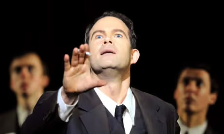

Gerald Finley as Oppenheimer in _Doctor Atomic_. (Less wet than in _L'Amour de Loin_)

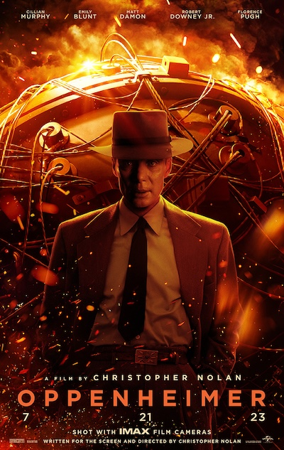

Cillian Murphy as Oppenheimer in _Oppenheimer_ (2023, dir. Christopher Nolan)

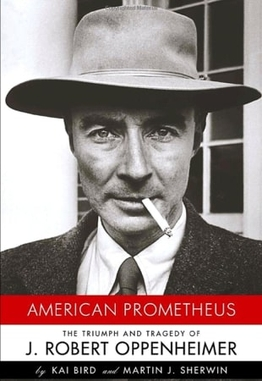

_American Promethus_ by Kai Bird and Martin J. Sherwin (2005). Pulitzer Prize winner. Source for Nolan's film.

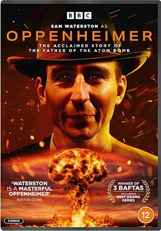

Sam Waterston as Oppenheimer in _Oppenheimer_ (1980, prod. BBC)

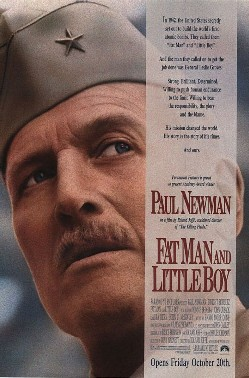

Paul Newman as Leslie Groves in _Fat Man and Little Boy_ (1989)

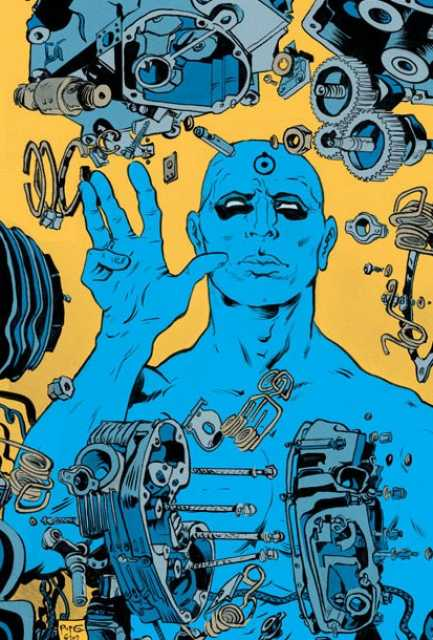

Dr. Manhattan in Alan Moore's _The Watchmen_ (1986-87)

---

On the other hand, the actual events and aftermath of the Hiroshima and Nagasaki bombings have been depicted many times in Japanese media:

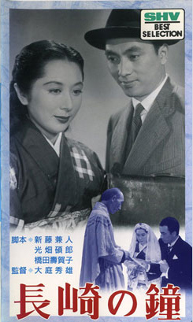

_The Bells of Nagasaki_ (1950) portrays the experiences of a Nagasaki survior. Based on a 1949 novel.

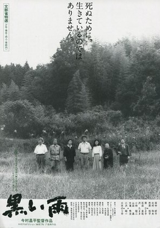

_Black Rain_ 黒い雨 (1989, dir. Shohei Imamura), based on a 1965 novel.


_The Face of Jizo_ (2004, dir. Kazuo Kuroki) follows a Hiroshima survivor whose father was killed in the bombing


_In This Corner of the World_ (2016) tells the story of a young girl in Hiroshima before and after the bombing

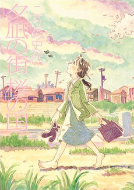

_Town of Evening Calm, Country of Cherry Blossoms_ (2004 manga), about a family of Hiroshima survivors

---

> In his study of the opera, Maarten Nellestijn argues that Doctor Atomic expresses a distrust of nuclear weaponry refracted through the imaginary lens of the 1960s genre of nuclear monster films; he compares the opera’s narrative to the typical plot of these films: “a deserted location with a nuclear explosion, nature taking revenge in the form of an angered or mutated monster of some kind, alarmed and/or curious scientists accompanied by their beautiful female assistants, and natural hindrances seemingly preventing the monster’s destruction” (Everett 8)

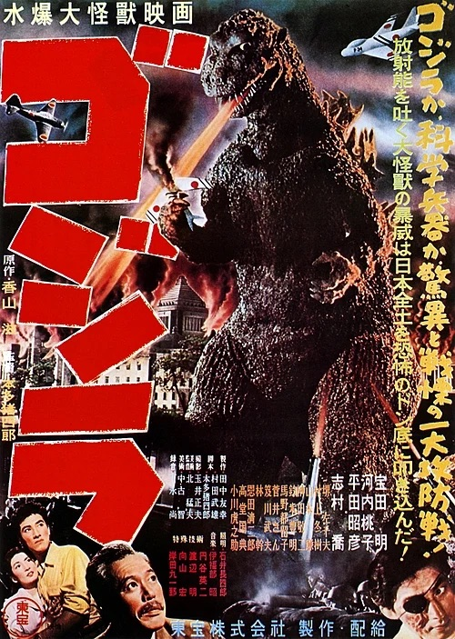

The original _Godzilla_ (1954) links the monster to American nuclear bomb testing and directly references the WWII bombings

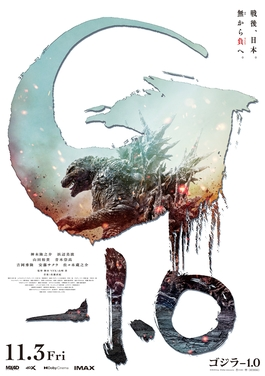

_Godzilla Minus One_ (2023) takes place immediately after the end of the war in destroyed Japanese cities

---

# Does Adams present Robert Oppenheimer as a hero? An anti-hero? Faust?

None of the characters in _Doctor Atomic_ seems to have much agency, including Robert. Robert pushes for the test in the opening scene, but spends most of the opera on the sidelines. At times, he seems almost distracted, like a poet-warrior reciting sonnets while a battle rages around him.

The real Oppenheimer is a complex figure: a renowned physicist who ushered in the age of nuclear weapons, a sensitive art lover who quoted poetry and read the _Bhagavad Gita_ in Sanskrit, a key figure in the anti-nuclear arms movement, and a target of the Red Scare. According to Everett, Adams and Sellers largely rejected the idea of a "Faustian" Oppenheimer. Which version of Robert Oppenheimer do Sellers and Adams choose to depict? Does _Doctor Atomic_ present him as a hero? An anti-hero? A Faustian figure who sold his soul for wisdom?

---

# Let's talk about the weather.

Weather drives much of the suspense in _Doctor Atomic_. Finding the right time for the Trinity Test is a major plot point that leads to both tension and humor (e.g. Groves berating the meteorologist). Something as mundane as the weather seems ironic in the context of World War II and the nuclear arms race. And yet, real events in WWII history (like bombing runs) were determined by the weather.

Was the emphasis on weather simply a plot device to create tension and move the opera forward? Or does it represent a larger theme of the powerlessness of humans against forces of nature?

---

# Human (Kitty) vs. Superhuman (Robert)

```
Kitty:
The motive of all of it was loneliness,
All the panic encounters and despair
Were bred in fear of the lost night, apart, Outlined by pain, alone. Promiscuous
As mercy. Fear – led and led again to fear
At evening toward the cave where part fire, part Pity lived in that voluptuousness
To end one and begin another loneliness. This is the most intolerable motive: this Must be given back to life again,

Robert:
Made superhuman, made human, out of pain
Turned to the personal, the pure release:
The rings of Plato and Homer’s golden chain
Or Lenin with his cry of Dare We Win (. . .)
```

---

# _Doctor Atomic_ as postmodern collage?

Sellers directly borrows a wide variety of source material (list below) and Adams gave most of these quotations a distinct identity. IMO, _Doctor Atomic_ doesn't have a single, cohesive sound, but is rather a pastiche of separate episodes tied together by the overarching Adamsesque score. I admit that was often difficult for me to connect these quotations to the main plot -- which was perhaps the point. Because Adams' text settings are so (conventionally) beautiful and clear, it was easy to let the Donne sonnet and Baudelaire duet wash over me without thinking too deeply about how they tie in to the main story. At times, it felt a bit _Einstein On The Beach_-esque where I wasn't meant to think too deeply about individual words and instead 

The quoted material isn't random: most of it is material that Oppenheimer quoted frequently and/or books that were in his study.

To what extent do you think Adams and Sellers _want_ to connect these quotations to the Trinity Test story? Are they disconnected fragments that only become meaningful because they exist in the larger world of _Doctor Atomic_? Or do they actively constitute _Doctor Atomic_?

---

# Leslie Groves' diet: comic relief?

Everett describes the discussion of Groves' waistline and diet as comic relief. I'm not sure I entirely agree. It reads like comic relief in the libretto, but Groves is given a (conventionally) beautiful aria and a lot of stage time with this passage.

Groves' specific enumeration of his calorie count reminded me of the technical discussion of the atom bomb in the opening. I felt that this passage put the Manhattan Project in context -- everything is just numbers, whether it's an earth-changing physics breakthrough or a weight-loss program. It also relates to the mundanity of the weather in the midst of World War II.

---

# Pasqualita, Kitty, the Japanese woman, and _the frame_

I feel that _Doctor Atomic_ uses a dramatic framing device, much like _Written On Skin_ (though _Doctor Atomic's_ is much less explicit). Groves, Teller, the scientists and military are inside the frame, driving the plot forward. Kitty, Pasqualita, and the disembodied Japanese woman at the end are outside the frame, offering commentary and philosophical context for the events inside the frame. Robert moves in and out of the frame, at times central to the lead-up to the Trinity Test, and other times singing poems and sonnets that are only tangentially related to the world-changing events taking place around him.

Pasqualita is a partially-invented character. From what I could find, a real Pueblo woman named Pasquelita worked for Edwin McMillan, a different Los Alamos physicist, not the Oppenheimers. Pasqualita repeatedly only sings a single text, the Tewa "Cloud-Flower Lullaby" and never directly interacts with the rest of the cast. (I find the inclusion of Native American characters in the chorus kinda strange.)

Kitty, almost entirely outside the frame, interacts with Robert, but only obliquely and through their Baudelaire code.

The voice of the Japanese woman makes for a dramatic and moving conclusion to the opera. And yet, this single woman's voice becomes a synecdoche for the entire cataclysmic Hiroshima-Nagasaki bombings.

Sellers and Adams explicitly stated that Pasqualita and Kitty together represent an "eternal feminine" from Goethe's _Faust_. "Their prophetic voices contrast and complement the male scientists’ preoccupation with objective speculations about the success or failure of the testing, instead taking into account the moral compass of the experiment at hand." (Everett)

Taken together, _Doctor Atomic_ treats all non-male (and nonwhite -- the real Leslie Groves was white) as symbols rather than individuals with agency. This is (perhaps) problematic, but the real Manhattan Project and WWII leadership _was_ almost entirely white and male. Does the inclusion of Kitty, Pasqualita, and the Japanese woman broaden the story of _Doctor Atomic_ or simply result in tokenism?

---

# Why use many word when few do trick?

_Doctor Atomic_ is very wordy, especially because it uses technical language (particle physics and military jargon aren't exactly common themes in opera). We seemed to agree that Adès _Tempest_ was overly wordy, but I didn't personally get that impression from _DA_. What is different about Adams' text setting compared to Adès?

For fun, here's a list of polysyllabic words in the libretto (thanks, Claude AI):

**4 syllables**

acceptable, actually, alternatives, apologize, architectures, beatitude, beautifully, benevolent, busy-body, calculations, cancellation†, catastrophe, comparable, complicated, constellation, continual, counterattack, demoniac, demonstrated, demonstration, desirable, detonator(s), devastation, differently, difficulty, disintegrates, dissipated, electrical, embarrassing, establishment, eternity, evacuate, everybody, exercising, experience, experiment, generally*, generations, humanity, hysterical, ideally, immediate, impalpable, implacable, inadequate, inconsistent, indicated, inebriate, infinity, information, inhabitants, inspiration, interested*, interior, interwoven, introducing, inundated, liberated, luminescence, machinery, material, melancholy, modulated, monitoring, mortality, mysterious, omnipresent, operation, optimistic, ostensibly, particular, pentagonal, pessimism, phenomenon, plutonium, political, population, potentially, practicable, preoccupied, prematurely, priority, promiscuous, propagandist, psychiatrists, psychologist, psychology, publicity, radiation, reasonable, remarkable, remembering, resurrection, revelation, scientific, secondary, secretary, security, situation, subcritical, superfluous, superhuman, temperatures*, triangular, ultimatum, uncertainties, undiscovered, voluntary

**5 syllables**

accentuated, accompaniment†, anticipated, civilization, considerations, deliberation, dodecahedron, evacuation, icosahedron, imagination, immediately†, immortality, incendiary, individual, inexplicable, initiator, insupportable, intellectual, intolerable, laboratory, metabolism, meticulously, miscalculated, overexposure, possibility, psychological, radioactive, specifications, spontaneously, supercritical, superfortresses, unfavorable, visibility, volatility, voluptuousness

**6 syllables**

humanitarian, infinitesimal, insubordination, meteorologist, responsibility, unimaginable

**Proper nouns**

Four syllables: America, California†, Chupadera, Fukuoka, Hiroshima, Nagasaki, Oppenheimer, Pasqualita, Rukeyser† (spelled "Rukeysayer" in this copy), Yokohama.

Five syllables: Alamogordo†, Kistiakowsky (spelled "Kistiakosky" here).
